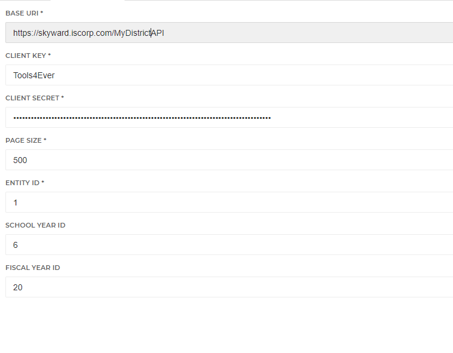

# HelloID-Conn-Prov-Source-Skyward-Qmlativ-Employees

| :information_source: Information |
|:---------------------------|
| This repository contains the connector and configuration code only. The implementer is responsible to acquire the connection details such as username, password, certificate, etc. You might even need to sign a contract or agreement with the supplier before implementing this connector. Please contact the client's application manager to coordinate the connector requirements.       |

 

  

HelloID Provisioning Source Connector for Skyward Qmlativ

<!-- TABLE OF CONTENTS -->
## Table of Contents
* [Getting Started](#getting-started)
* [Requirements](#Requirements)
* [Configuration](#configuration)

<!-- GETTING STARTED -->
## Getting Started
By using this connector you will have the ability to import data into HelloID:
* Employee Demographics
* Employee Employment/Positions 

## Requirements
- Access to Generic API

## Setting up the API Access
Within the Skyward Web interface, please follow these steps
- API > User Access
- Click Add User Access
  - Select Users or Add User
  - API Type = Generic
  - Save
- API > User
- Click on User
- Get "Consumer Key" and "Consumer "Secret"
 

## Configuration
1. Add a new 'Source System' to HelloID and make sure to import all the necessary files.

    - [ ] configuration.json
    - [ ] persons.ps1
    - [ ] departments.ps1
    - [ ] personMapping.json

2. Fill in the required fields on the 'Configuration' tab.

* Base URI
  * URL to Generic API
* Client Key
* Client Secret
* Page Size
* Entity ID
* School Year ID
* Fiscal Year ID

# HelloID Docs
The official HelloID documentation can be found at: https://docs.helloid.com/
