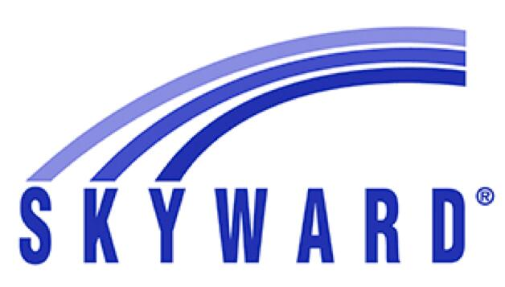

# HelloID-Conn-Prov-Source-Skyward-Qmlativ-Employees

  

HelloID Provisioning Source Connector for Skyward Qmlativ

<!-- TABLE OF CONTENTS -->
## Table of Contents
* [Getting Started](#getting-started)
* [Requirements](#Requirements)
* [Configuration](#configuration)

<!-- GETTING STARTED -->
## Getting Started
By using this connector you will have the ability to import data into HelloID:
* Employee Demographics
* Employee Employment/Positions 

## Requirements
- Access to Generic API
Note: Ensure that the Skyward API Server has been installed. Refer to the Skyward documentation for more information.
https://support.skyward.com/DeptDocs/Corporate/IT%20Services/Public%20Website/Technical%20Information/system/current_requirements/Api%20Server%20Launch%20kit.pdf

To create a Secured User account within the Skyward database for your ClassLink Roster Server follow these steps below:
 1. Browse to “Product Setup – Skyward Contact Access – Secured User”.
 2. Click Add.
 3. Click the Organization button.
 4. Enter ClassLink as the Organization (Vendor) Name.
 5. Click Add Entered name to Secure Users.
 6. Click Save.
 7. Highlight the New Organization User in the Secured User list, then click the API button at the lower-right corner of the screen.
 8. Click Generate New key.
 9. Record the values for the Key and Secret.

## Configuration
1. Add a new 'Source System' to HelloID and make sure to import all the necessary files.

    - [ ] configuration.json
    - [ ] persons.ps1
    - [ ] departments.ps1
    - [ ] personMapping.json

2. Fill in the required fields on the 'Configuration' tab.

* Base URI
  * URL to Generic API
* Client Key
* Client Secret
* Page Size
* Entity ID
* School Year ID
* Fiscal Year ID

# HelloID Docs
The official HelloID documentation can be found at: https://docs.helloid.com/
